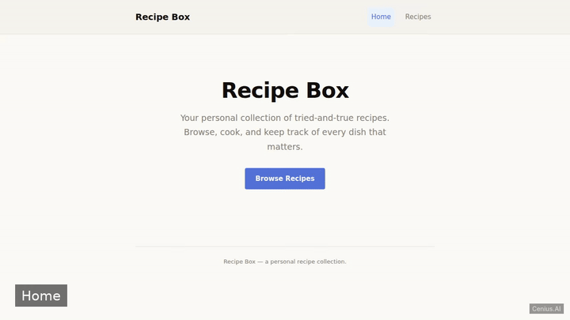
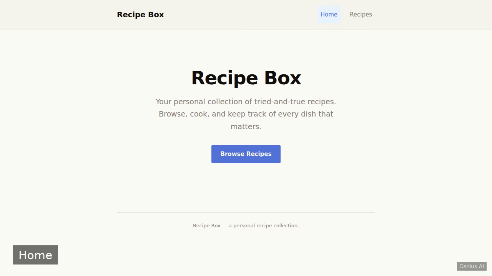
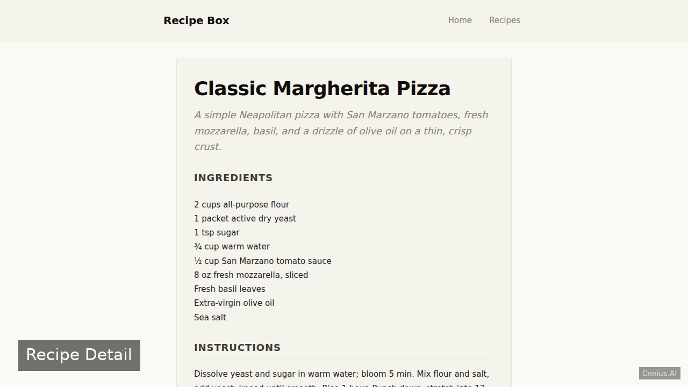

# Recipe Box — complete Ruby on Rails recipe manager example app

Want to run your own recipe manager without paying for SaaS? **Recipe Box** is a free, Apache-2.0-licensed Ruby on Rails project that you can clone and self-host today. A minimal server-rendered Ruby on Rails web application for viewing a collection of recipes. Every Recipe Box feature — every screen, every seed record — is here. [Open Recipe Box on cenius.ai](https://cenius.ai/marketplace/p/recipe-box-3?ref=gh&utm_campaign=recipe-box-rails) to modify it without writing code.


[](LICENSE)  [](https://cenius.ai)

[](https://cenius.ai/marketplace/p/recipe-box-3?ref=gh&utm_campaign=recipe-box-rails)

> **▶ [Open & edit in cenius.ai](https://cenius.ai/marketplace/p/recipe-box-3?ref=gh&utm_campaign=recipe-box-rails)** — one click to an editable workspace: describe changes in plain English, get an instant preview, one-click deploy and host. Modifications made on the platform come with full rebrand & relicense rights.

_Local clone? See [Quick start](#quick-start) below. cenius.ai is the zero-setup path._

## Demo



▶ **[Watch the full demo video](https://cenius.ai/marketplace/p/recipe-box-3?ref=gh&utm_campaign=recipe-box-rails)** — the complete walkthrough, playing on the project's cenius.ai page · [MP4 file](.github/media/demo.mp4)

## Screenshots

  

## Features

- View recipe list
- View recipe details
- Landing page

## Architecture

A self-contained Ruby on Rails project (1,887 files): top-level directories include `app/`, `bin/`, `config/`, `db/`, `lib/`, `log/`, `public/`, `storage/`. `install.sh` takes care of packages and initial data in a single pass; nothing else is required before launching. See [`INSTALL.md`](INSTALL.md) for complete setup instructions.

## Quick start

```bash
./install.sh   # installs dependencies + seeds demo data
```

See [`INSTALL.md`](INSTALL.md) for full setup and usage instructions.

## Usage guide

Once the application is running, you can interact with it via your browser or using `curl`.

### Pages

#### Home Page

The home page is served at the root URL. Open [http://localhost:3000/](http://localhost:3000/) in your browser or run:

```bash
curl http://localhost:3000/
```

It displays a welcome message and a link to browse recipes.

#### Recipe Index

Browse all recipes by visiting `http://localhost:3000/recipes`. You can also access it with:

```bash
curl http://localhost:3000/recipes
```

This page lists all seeded recipes, each linking to its detail page.

#### Recipe Detail

View a specific recipe by navigating to `/recipes/:id`, for example [http://localhost:3000/recipes/1](http://localhost:3000/recipes/1). With `curl`:

```bash
curl http://localhost:3000/recipes/1
```

The page shows the full details of the selected recipe.

### Navigation

From the home page, click the link to browse the recipe collection. On the index page, click any recipe title to view its details.

### Seed Data

The application comes preloaded with approximately 10 sample recipes. You can add your own by modifying `db/seeds.rb` and re-running `ruby bin/rails db:seed`.

_Full guide: [`USAGE.md`](USAGE.md)_

## FAQ

### How do I run Recipe Box on my own server?

Grab the repo and run `./install.sh` — it handles packages and seed data in one go. After that, [`INSTALL.md`](INSTALL.md) walks you through starting the server. No external accounts required.

### Is white-labeling Recipe Box allowed?

Absolutely. [Open it on cenius.ai](https://cenius.ai/marketplace/p/recipe-box-3?ref=gh&utm_campaign=recipe-box-rails) and remix it there — platform modifications come with full rebrand and relicense rights over your derivative, so the result is entirely yours.

### Can I use Recipe Box in a commercial project?

Confirmed free for commercial use — MIT terms let you incorporate, resell, or ship it in any product. [LICENSE](LICENSE).

### What is Recipe Box built with?

Powered by Ruby on Rails. This repo is the real thing — full source, seed data, and all — ready to clone and start up. Highlights include landing page.

### Can I change Recipe Box without writing code?

The easiest route: [visit the project on cenius.ai](https://cenius.ai/marketplace/p/recipe-box-3?ref=gh&utm_campaign=recipe-box-rails), tell the platform what to change, and collect the updated build. No source-editing needed.

## License & rebranding

Released under the [Apache License 2.0](LICENSE) (© 2026 Cenius AI) — free for personal and commercial use. The Cenius name/logo are trademarks (see NOTICE).

**Need a customized version?** [Remix this app on cenius.ai](https://cenius.ai/marketplace/p/recipe-box-3?ref=gh&utm_campaign=recipe-box-rails) — modifications made on the platform come with **full rebrand & relicense rights** over your derivative.

## Built with cenius.ai

This entire application — code, design, seeded demo data — was generated on **[cenius.ai](https://cenius.ai)** from a plain-English description.

- 🚀 [Build your own app on cenius.ai](https://cenius.ai)
- 🎛️ [Remix Recipe Box on the marketplace](https://cenius.ai/marketplace/p/recipe-box-3?ref=gh&utm_campaign=recipe-box-rails) — open it in a workspace, prompt for changes, and ship your own version.

More open-source apps: [the Cenius-ai catalog](https://github.com/Cenius-ai) · [showcase index](https://github.com/Cenius-ai/showcase)
